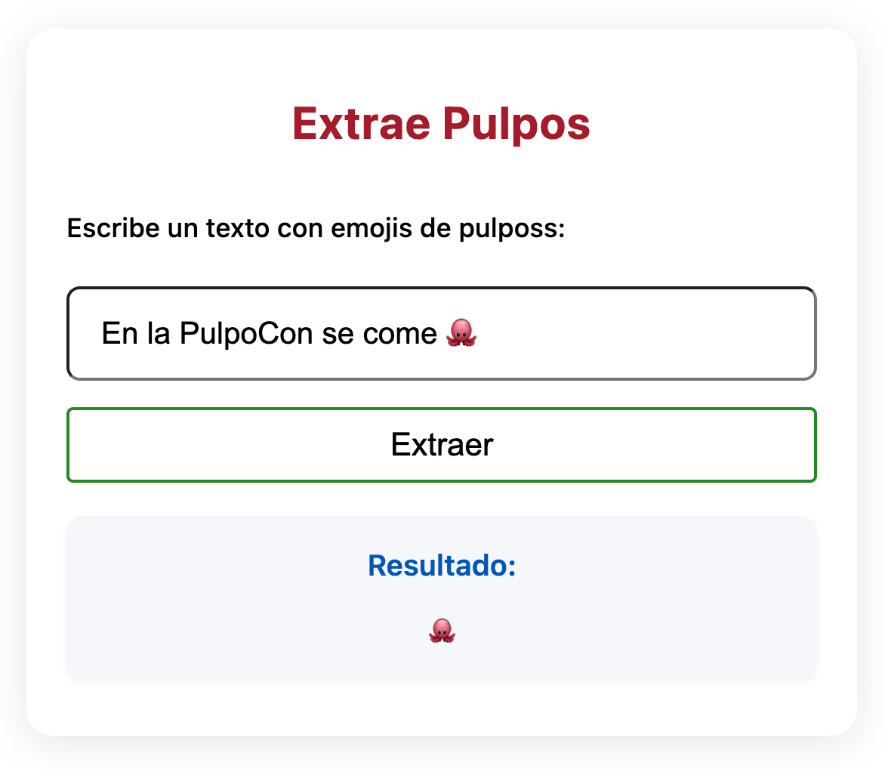

# KATA: ESCRIBE TU PRIMER CICLO DE TDD - Extract Pulpos 🐙

## OBJETIVO

Elige tu primer test de entre tu lista de casos de uso de la kata 1 y escribe el primer ciclo de TDD.

## REQUISITOS

Implementa una función con la siguiente firma:

```typescript
function extractPulpos(text: string): string
```



## ENFOQUE TDD

### 🔴 RED - 🟢 GREEN - 🔵 REFACTOR

#### Tu tarea:

1. **Selecciona el caso más simple** de tu lista de casos de uso
2. **Escribe UN SOLO TEST** que falle por la razón correcta
3. **Implementa el mínimo código** para hacer pasar ese test
4. **Commitea** cuando estés en verde
4. **Refactoriza** si es necesario
5. **Commitea** cuando estés en verde

### 💡 Tips

- **Baby Steps**: Empieza con el caso más simple
- **Fake it**: Para el primer test, puedes retornar directamente el resultado esperado
- **Test primero**: No escribas código de producción sin un test que falle
- **Una cosa a la vez**: Solo un test, solo la implementación mínima

### 🎯 Objetivos de Aprendizaje

- Practicar el ciclo RED-GREEN-REFACTOR
- Experimentar con "fake it till you make it"
- Entender la disciplina del TDD estricto
- Sentir la seguridad que dan los tests

### ⚠️ Recordatorio

- **NO** implementes todos los casos de una vez
- **NO** escribas código sin un test que falle primero
- **SÍ** usa baby steps: cambios pequeños e incrementales

## REFLEXIÓN POST-KATA

Después de completar tu primer ciclo de TDD, reflexiona:

1. ¿Escribiste el test antes que el código de implementación?
2. ¿Viste el test fallar por la razón correcta (rojo)?
3. ¿Implementaste solo el mínimo código para hacer pasar el test (verde)?
4. ¿Hiciste algún refactoring después de que el test pasara?
5. ¿Cómo te sentiste siguiendo la disciplina estricta del TDD?

