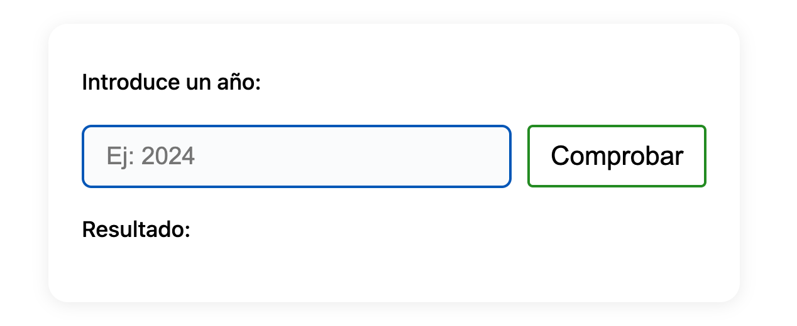

# KATA: LEAP YEAR (AÑO BISIESTO)

## OBJETIVO

Escribe una función o una classe que determine si un año es bisiesto o no.

## REQUISITOS

Implementa una función o metodo con una de las siguientes firmas:

```typescript
function isLeapYear(year: number): boolean

interface Year {
  isLeapYear(): boolean
}
```

## CRITERIOS DE ACEPTACIÓN:

### Reglas de Año Bisiesto

1. Un año **NO** es bisiesto si no es divisible por 4
2. Un año **ES** bisiesto si es divisible por 4
3. Un año **ES** bisiesto si es divisible por 400
4. Un año **NO** es bisiesto si es divisible por 100 pero NO por 400

### Ejemplos

- `isLeapYear(1997)` → `false` (no divisible por 4)
- `isLeapYear(1996)` → `true` (divisible por 4, no por 100)
- `isLeapYear(2000)` → `true` (divisible por 400)
- `isLeapYear(1900)` → `false` (divisible por 100, pero no por 400)
- `isLeapYear(2004)` → `true` (divisible por 4, no por 100)
- `isLeapYear(2100)` → `false` (divisible por 100, pero no por 400)



## ENFOQUE TDD

### 📝 Tu Primera Tarea

1. **Analiza las reglas** cuidadosamente
2. **Crea tu lista de casos de test** ordenándolos de simple a complejo
3. **Considera los ejemplos dados** pero crea tu propia estrategia de orden
4. **Usa triangulación** para forzar la implementación de cada regla

### 🔴 RED - 🟢 GREEN - 🔵 REFACTOR

#### Estrategias TDD

1. **Fake it**: Comienza con el caso más simple
2. **Triangulación**: Usa múltiples casos para forzar generalización  
3. **Baby steps**: Una regla a la vez
4. **Refactoring**: Simplifica cuando detectes patrones

### 💡 Tips de Implementación

- **Baby steps**: No intentes implementar todas las reglas de una vez
- **Orden de las condiciones**: Piensa en qué orden evaluar las reglas
- **Claridad sobre eficiencia**: Prioriza código legible
- **Nombres descriptivos**: Considera extraer condiciones a variables con nombres claros

## 🎯 Objetivos de Aprendizaje

- **Lógica condicional compleja**: Manejar múltiples reglas interdependientes
- **Triangulación**: Usar múltiples ejemplos para descubrir el algoritmo
- **Refactoring de condicionales**: Simplificar expresiones booleanas complejas
- **Edge cases**: Identificar y manejar casos especiales

## REFLEXIÓN POST-KATA

1. ¿En qué orden implementaste las reglas?
2. ¿Cómo manejaste la complejidad de las condiciones?
3. ¿Qué refactorings aplicaste?
4. ¿Tu solución final es fácil de entender?
5. ¿Cómo explicarías las reglas a alguien leyendo tu código?
